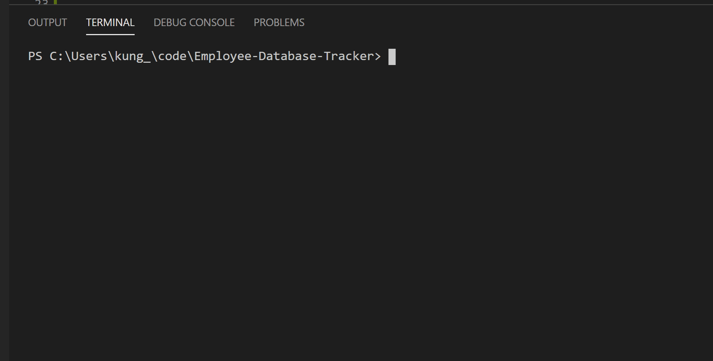

# Employee-Database-Tracker

## Description 

This app allows for a user to build a company profile. It enables the creation of departments, employees, and job roles, as well as being able to edit, view, and remove them if necessary. It utilizes a MySQL backed database and command line interface to perform its functions. 

## Table of Contents

* [Installation](#installation)
* [Usage](#usage)
* [Tests](#tests)
* [Questions](#questions)
* [Miscellaneous](#miscellaneous)
* [Credits](#credits)
* [License](#license)

## Installation

Installing npm packages of inquirer, mysql, and console.table are required for best performance of this

## Usage 

From the command line, initialize file with `node server.js` after installing necessary npm packages. From there, follow the user prompts to fill out information in the README file. Refer to the .gif below for a walkthrough.

## Tests

No tests were done, it's all super high risk.

## Questions

Please, hold all questions till the end.

## Miscellaneous

No other information is necessary.

## Credits

Special thanks to the instructional staff. 

## License

Licensed by MIT.

---

## Badges

If you have any questions, please feel free to contact me at dioncleung@gmail.com.

Here is a photo of my lovely face! 

---
© 2020 (https://github.com/dionleung14). All Rights Reserved.

